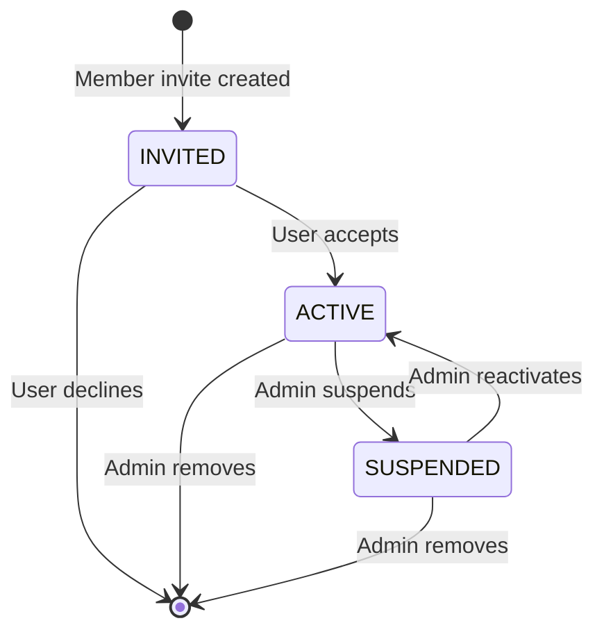

## Overview

**Memberships** represent the many-to-many relationship between users and companies. Each membership defines:

- A user's association with a specific company
- Their status within the company (invited, active, suspended)
- Their assigned roles and permissions
- Their organizational position (job title, department, supervisor)
- Contract details (type, hourly rate)

## Membership Model

```typescript Membership Structure
{
  id: "uuid",
  companyId: "uuid",
  userId: "uuid",
  status: "INVITED" | "ACTIVE" | "SUSPENDED",
  metadata: {},
  
  // Organizational details
  position: "Senior Software Engineer",
  department: "Engineering",
  
  // Contract information
  contractType: "EMPLOYEE" | "FREELANCE" | "INTERN" | "CONTRACTOR" | "OTHER",
  hourlyRate: 75.00,
  
  // Lifecycle timestamps
  invitedAt: "2024-01-01T00:00:00Z",
  activatedAt: "2024-01-02T10:30:00Z",
  expiresAt: null,
  
  // Supervisor hierarchy
  supervisorMembershipId: "supervisor-uuid" | null,
  
  // Audit
  createdAt: "2024-01-01T00:00:00Z",
  updatedAt: "2024-01-02T10:30:00Z",
  createdBy: "admin-uuid",
  updatedBy: "admin-uuid"
}
```


### Unique Constraint

Each user can only have **one membership per company**:

```typescript
@@unique([companyId, userId])
```

This ensures:

- No duplicate memberships
- Clear user-company relationship
- Simplified permission checks

## Membership Status

Memberships progress through different statuses:

<Steps>
  <Step title="INVITED">
    **Initial state** when a membership is created via invitation.
    
    **Characteristics:**
    - User can see the invitation in their pending invitations list
    - User cannot access company resources yet
    - Membership includes assigned roles (typically default role)
    - `invitedAt` timestamp is set
    - `activatedAt` is null
    
    **Next Actions:**
    - User accepts → Status changes to `ACTIVE`
    - User declines → Membership is deleted
    - Invitation expires → Optionally auto-expire membership
  </Step>
  
  <Step title="ACTIVE">
    **Active state** when user has accepted the invitation.
    
    **Characteristics:**
    - User has full access to company resources (subject to permissions)
    - User appears in company member lists
    - Roles and permissions are enforced
    - `activatedAt` timestamp is set
    
    **Next Actions:**
    - Admin suspends member → Status changes to `SUSPENDED`
    - Admin removes member → Membership is deleted
  </Step>
  
  <Step title="SUSPENDED">
    **Suspended state** when access is temporarily revoked.
    
    **Characteristics:**
    - User cannot access company resources
    - Membership data is preserved
    - Can be reactivated by admin
    - User still appears in member lists (with suspended indicator)
    
    **Next Actions:**
    - Admin reactivates → Status changes to `ACTIVE`
    - Admin removes member → Membership is deleted
  </Step>
</Steps>


### Status Transitions



## Contract Types

Memberships include contract classification for employment tracking:

<Tabs>
  <Tab title="EMPLOYEE">
    Full-time or part-time employees with standard employment contracts.
    
    **Common for:**
    - Regular staff members
    - Salaried positions
    - Benefits-eligible workers
  </Tab>
  
  <Tab title="FREELANCE">
    Independent contractors working on a project or hourly basis.
    
    **Common for:**
    - Project-based work
    - Short-term engagements
    - Specialized consultants
  </Tab>
  
  <Tab title="INTERN">
    Temporary positions for students or recent graduates.
    
    **Common for:**
    - Summer internships
    - Co-op programs
    - Training positions
  </Tab>
  
  <Tab title="CONTRACTOR">
    Contract workers, often through staffing agencies.
    
    **Common for:**
    - Temporary staffing
    - Seasonal work
    - Vendor-supplied workers
  </Tab>
  
  <Tab title="OTHER">
    Catch-all for non-standard employment types.
    
    **Common for:**
    - Volunteers
    - Board members
    - Advisors
  </Tab>
</Tabs>


### Hourly Rate

Optional `hourlyRate` field stores compensation for time tracking:

```typescript
hourlyRate: Decimal? @db.Decimal(10,2)
```

**Used for:**

- Time entry calculations
- Project costing
- Payroll estimation
- Client billing


## Supervisor Hierarchy

Memberships support a self-referential supervisor structure:

```typescript Supervisor Relationship
{
  supervisorMembershipId: "uuid" | null,
  
  supervisor: Membership | null,
  subordinates: Membership[]
}
```

**Key Points:**

- `supervisorMembershipId` references another membership in the **same company**
- Creates a tree structure within each company
- `ON DELETE SetNull` - removing supervisor preserves subordinate records
- One supervisor per member (direct reporting structure)


### Hierarchy Example

```typescript
CEO (no supervisor)
├── VP Engineering (supervisor: CEO)
│   ├── Engineering Manager (supervisor: VP Engineering)
│   │   ├── Senior Developer (supervisor: Engineering Manager)
│   │   └── Junior Developer (supervisor: Engineering Manager)
│   └── QA Lead (supervisor: VP Engineering)
└── VP Sales (supervisor: CEO)
    └── Sales Manager (supervisor: VP Sales)
```

### Querying Hierarchy

<CodeGroup>
```typescript Get Direct Reports
// Find all direct reports for a member
const subordinates = await prisma.membership.findMany({
  where: {
    companyId: "company-uuid",
    supervisorMembershipId: "manager-membership-uuid"
  },
  include: {
    user: { select: { id: true, fullName: true, email: true } }
  }
});
```

```typescript Get Supervisor Chain
// Get member with supervisor information
const member = await prisma.membership.findUnique({
  where: { id: "member-uuid" },
  include: {
    supervisor: {
      include: {
        user: { select: { fullName: true, email: true } },
        supervisor: {
          include: {
            user: { select: { fullName: true, email: true } }
          }
        }
      }
    }
  }
});

// Result: member → manager → director chain
```

```typescript Count Team Size
// Get member with subordinate count
const member = await prisma.membership.findUnique({
  where: { id: "member-uuid" },
  include: {
    _count: { select: { subordinates: true } }
  }
});

console.log(`${member._count.subordinates} direct reports`);
```
</CodeGroup>

## Role Assignment

Memberships can have multiple roles through the `MembershipRole` join table:

```typescript
const membership = await prisma.membership.findUnique({
  where: { id: "membership-uuid" },
  include: {
    roles: {
      include: { role: true }
    }
  }
});

// Result
{
  id: "membership-uuid",
  userId: "user-uuid",
  status: "ACTIVE",
  roles: [
    { 
      membershipId: "membership-uuid",
      roleId: "admin-role-uuid",
      role: { name: "Admin", color: "#F59E0B" }
    },
    { 
      membershipId: "membership-uuid",
      roleId: "developer-role-uuid",
      role: { name: "Developer", color: "#10B981" }
    }
  ]
}
```


## Membership Operations

### List Company Members

```typescript
GET /api/companies/:companyId/members

// Response
{
  "success": true,
  "data": [
    {
      "id": "membership-uuid",
      "companyId": "company-uuid",
      "userId": "user-uuid",
      "status": "ACTIVE",
      "position": "Senior Engineer",
      "department": "Engineering",
      "invitedAt": "2024-01-01T00:00:00Z",
      "activatedAt": "2024-01-02T10:30:00Z",
      "user": {
        "id": "user-uuid",
        "email": "john@example.com",
        "firstName": "John",
        "lastName": "Doe",
        "avatarUrl": "https://..."
      },
      "roles": [
        {
          "id": "role-uuid",
          "name": "Developer",
          "color": "#10B981"
        }
      ]
    }
  ]
}
```


### Invite Member

```typescript
POST /api/companies/:companyId/members/invite
{
  "userId": "user-uuid",
  "position": "Software Engineer",
  "department": "Engineering"
}

// Creates membership with status: INVITED
// Auto-assigns company's default role
// Sends real-time notification to user
```


### Update Member Roles

```typescript
PUT /api/companies/:companyId/members/:memberId/roles
{
  "roleIds": [
    "admin-role-uuid",
    "developer-role-uuid"
  ]
}

// Replaces all existing role assignments
// Returns updated membership with new roles
```


### Remove Member

```typescript
DELETE /api/companies/:companyId/members/:memberId

// Deletes membership (hard delete)
// Cascades to MembershipRole records
// User loses access to company immediately
```


### User's Pending Invitations

```typescript
GET /api/invitations/pending

// Returns memberships where:
// - userId = current user
// - status = INVITED
// - company.deletedAt IS NULL
{
  "invitations": [
    {
      "id": "membership-uuid",
      "company": {
        "id": "company-uuid",
        "name": "Acme Corp",
        "slug": "acme-corp",
        "logo": "https://..."
      },
      "roles": [
        { "id": "role-uuid", "name": "Member", "color": "#6B7280" }
      ],
      "invitedAt": "2024-01-01T00:00:00Z"
    }
  ]
}
```


### Accept Invitation

```typescript
POST /api/invitations/:membershipId/accept

// Updates membership:
// - status: ACTIVE
// - activatedAt: now
// User can now access company resources
```


### Decline Invitation

```typescript
POST /api/invitations/:membershipId/decline

// Deletes the membership
// User will not join the company
```


## Search Non-Members

When inviting members, you can search for users who are not yet members:

```typescript
GET /api/companies/:companyId/members/search-non-members?search=john

// Returns users where:
// - isDisabled = false
// - id NOT IN (existing member user IDs)
// - fullName or email contains search term
{
  "users": [
    {
      "id": "user-uuid",
      "email": "john@example.com",
      "firstName": "John",
      "lastName": "Doe",
      "avatarUrl": "https://..."
    }
  ]
}
```


## Metadata Field

Memberships include a flexible `metadata` JSON field:

```typescript
metadata: Json? @default("{}")
```

**Use cases:**

- Custom fields per company (employee ID, office location, etc.)
- Integration data (external system references)
- Temporary flags or settings
- Audit trail for custom workflows

**Example:**

```typescript
{
  "metadata": {
    "employeeId": "EMP-12345",
    "officeLocation": "San Francisco HQ",
    "startDate": "2024-01-15",
    "customFields": {
      "shirtSize": "L",
      "dietaryRestrictions": "vegetarian"
    }
  }
}
```


## Access Control

Memberships are the foundation of company-level access control:

### Checking Access

```typescript
const hasAccess = async (userId: string, companyId: string) => {
  // Platform admins have access to all companies
  const platformAdmin = await prisma.platformAdmin.findUnique({
    where: { userId }
  });
  if (platformAdmin) return true;

  // Check for active membership
  const membership = await prisma.membership.findUnique({
    where: {
      companyId_userId: { companyId, userId }
    }
  });

  return membership?.status === 'ACTIVE';
};
```

### Middleware Integration

The `checkCompanyAccess` middleware uses memberships:

```typescript
export const checkCompanyAccess = async (req, res, next) => {
  const userId = req.user.userId;
  const companyId = req.params.companyId;

  // Platform admins bypass
  if (req.isPlatformAdmin) {
    return next();
  }

  // Check membership
  const membership = await prisma.membership.findUnique({
    where: { companyId_userId: { companyId, userId } }
  });

  if (!membership) {
    throw ApiError.forbidden('You do not have access to this company');
  }

  // Store membership for later use
  req.membership = membership;
  next();
};
```


## Best Practices

<CardGroup cols={2}>
  <Card title="Validate Company Context" icon="check-double">
    When updating memberships, verify that related entities (roles, supervisors) belong to the same company.
  </Card>
  
  <Card title="Handle Status Transitions" icon="arrow-right-arrow-left">
    Implement proper state machines for status changes. Validate that transitions are valid (e.g., can't go from INVITED to SUSPENDED).
  </Card>
  
  <Card title="Audit Membership Changes" icon="clock-rotate-left">
    Log who added, removed, suspended, or reactivated members. Track role assignments and supervisor changes.
  </Card>
  
  <Card title="Clean Up Invitations" icon="broom">
    Periodically review INVITED memberships and expire those past their invitation date.
  </Card>
</CardGroup>

<CardGroup cols={2}>
  <Card title="Prevent Circular Supervisors" icon="arrows-spin">
    Validate supervisor assignments to prevent cycles in the hierarchy (A → B → C → A).
  </Card>
  
  <Card title="Handle Member Removal" icon="user-xmark">
    When removing a member, decide what to do with their subordinates (reassign or clear supervisor).
  </Card>
  
  <Card title="Use Soft Suspensions" icon="user-slash">
    Prefer SUSPENDED status over deletion to preserve membership history and enable reactivation.
  </Card>
  
  <Card title="Optimize Queries" icon="gauge-high">
    Use the composite index on `(companyId, userId)` for access checks. Include roles/user data in single queries.
  </Card>
</CardGroup>

## Related Concepts

<CardGroup cols={2}>
  <Card title="Multi-Tenancy" icon="building" href="/concepts/multi-tenancy">
    Learn how memberships connect users to company tenants
  </Card>
  
  <Card title="RBAC" icon="key" href="/concepts/rbac">
    Understand how roles are assigned to memberships
  </Card>
  
  <Card title="Invitations" icon="envelope" href="/concepts/invitations">
    Explore how memberships are created via invitations
  </Card>
</CardGroup>