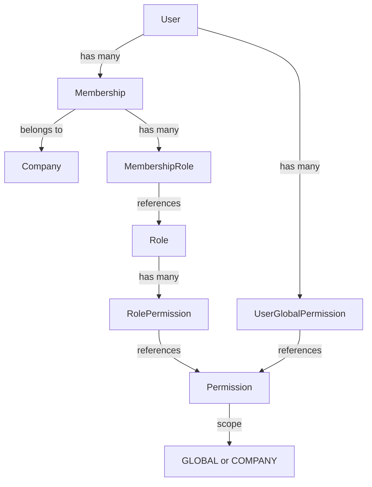

## Overview

The Platform API uses a flexible **Role-Based Access Control (RBAC)** system with two permission scopes:

- **Company-scoped permissions**: Managed through roles within each company (tenant)
- **Global permissions**: Platform-level permissions assigned directly to users

## Architecture



## Permissions

### Permission Model

Permissions are defined globally and can be assigned at two levels:

```typescript Permission Structure
{
  id: "uuid",
  key: "companies.create",
  description: "Create new companies",
  scope: "GLOBAL" | "COMPANY"
}
```

**Key Fields:**

- `key`: Unique identifier in dot notation (e.g., `members.invite`, `projects.delete`)
- `description`: Human-readable explanation of what the permission allows
- `scope`: Determines how the permission can be assigned

See [schema.prisma:273-282](/workspace/source/prisma/schema.prisma)

### Permission Scopes

<Tabs>
  <Tab title="COMPANY Scope">
    **Company-scoped permissions** are managed through roles within each company.

    - Assigned to **Roles**, which are then assigned to **Memberships**
    - Only effective within a specific company context
    - Each company can configure roles independently
    - Default scope for most business logic permissions

    **Examples:**
    - `members.invite` - Invite new members to the company
    - `projects.create` - Create projects within the company
    - `time-entries.manage` - Manage time entries for the company
  </Tab>
  
  <Tab title="GLOBAL Scope">
    **Global permissions** are platform-level and assigned directly to users.

    - Assigned to **Users** via `UserGlobalPermission`
    - Effective across the entire platform
    - Not tied to any specific company
    - Used for administrative and cross-tenant operations

    **Examples:**
    - `companies.create` - Create new companies
    - `platform.admin` - Full platform administration
    - `users.manage` - Manage global user accounts
  </Tab>
</Tabs>

### Permission Assignment

<CodeGroup>
```typescript Company Permission (via Role)
// 1. Create or find role
const adminRole = await prisma.role.create({
  data: {
    companyId: "company-uuid",
    name: "Admin",
    description: "Company administrator"
  }
});

// 2. Assign permissions to role
await prisma.rolePermission.createMany({
  data: [
    { roleId: adminRole.id, permissionId: "members.invite" },
    { roleId: adminRole.id, permissionId: "projects.create" },
    { roleId: adminRole.id, permissionId: "roles.manage" }
  ]
});

// 3. Assign role to membership
await prisma.membershipRole.create({
  data: {
    membershipId: "membership-uuid",
    roleId: adminRole.id
  }
});
```

```typescript Global Permission
// Assign global permission directly to user
await prisma.userGlobalPermission.create({
  data: {
    userId: "user-uuid",
    permissionId: "companies.create",
    grantedBy: "admin-uuid"
  }
});
```
</CodeGroup>

## Roles

### Role Model

Roles are company-specific and group related permissions:

```typescript Role Structure
{
  id: "uuid",
  companyId: "uuid",
  name: "Admin",
  description: "Company administrator with elevated privileges",
  color: "#F59E0B",
  isSystem: true,
  isDefault: false,
  createdAt: "2024-01-01T00:00:00Z",
  updatedAt: "2024-01-01T00:00:00Z"
}
```

**Key Fields:**

- `name`: Must be unique within the company
- `color`: Hex color for UI display (defaults to `#6366F1`)
- `isSystem`: Protected system roles that cannot be deleted
- `isDefault`: One role per company marked as default for new members

See [schema.prisma:240-270](/workspace/source/prisma/schema.prisma)

### System Roles

When a company is created, four default roles are automatically generated:

<CardGroup cols={2}>
  <Card title="Owner" icon="crown">
    **Color:** `#EF4444` (Red)  
    **System:** Yes  
    **Default:** No
    
    Full control over the company. Typically assigned to the company creator.
  </Card>
  
  <Card title="Admin" icon="user-shield">
    **Color:** `#F59E0B` (Orange)  
    **System:** Yes  
    **Default:** No
    
    Elevated privileges for managing company resources and members.
  </Card>
  
  <Card title="Manager" icon="user-tie">
    **Color:** `#3B82F6` (Blue)  
    **System:** No  
    **Default:** No
    
    Team oversight and project management capabilities.
  </Card>
  
  <Card title="Member" icon="user">
    **Color:** `#6B7280` (Gray)  
    **System:** Yes  
    **Default:** Yes
    
    Standard member with basic access. Automatically assigned to new members.
  </Card>
</CardGroup>

See [companies.service.ts:37-87](/workspace/source/src/modules/companies/services/companies.service.ts)

### Role Management

<AccordionGroup>
  <Accordion title="Create Role" icon="plus">
    ```typescript
    POST /api/companies/:companyId/roles
    {
      "name": "Developer",
      "description": "Software development team members",
      "color": "#10B981"
    }
    ```
    
    Role names must be unique within the company.
  </Accordion>
  
  <Accordion title="Update Role" icon="pen">
    ```typescript
    PATCH /api/companies/:companyId/roles/:roleId
    {
      "name": "Senior Developer",
      "description": "Lead software developers",
      "color": "#059669"
    }
    ```
    
    System roles can be updated but not deleted.
  </Accordion>
  
  <Accordion title="Delete Role" icon="trash">
    ```typescript
    DELETE /api/companies/:companyId/roles/:roleId
    ```
    
    Deletion fails if:
    - Role has `isSystem: true`
    - Role is assigned to any members (delete restriction)
  </Accordion>
  
  <Accordion title="Set Default Role" icon="star">
    ```typescript
    PATCH /api/companies/:companyId/roles/:roleId
    {
      "isDefault": true
    }
    ```
    
    Only one role per company can be marked as default. The previous default is automatically unmarked.
  </Accordion>
</AccordionGroup>

## Membership Roles

### Many-to-Many Relationship

A membership can have multiple roles, and a role can be assigned to multiple memberships:

```typescript MembershipRole Join Table
{
  membershipId: "uuid",
  roleId: "uuid"
}
```

**Database Constraints:**

- Primary key on `(membershipId, roleId)` prevents duplicates
- `ON DELETE Cascade` on membership - removing membership deletes role assignments
- `ON DELETE Restrict` on role - cannot delete role if assigned to any member

See [schema.prisma:299-311](/workspace/source/prisma/schema.prisma)

### Assigning Roles to Members

```typescript Update Member Roles
PUT /api/companies/:companyId/members/:memberId/roles
{
  "roleIds": [
    "admin-role-uuid",
    "developer-role-uuid"
  ]
}
```

This endpoint:

1. Removes all existing role assignments for the member
2. Creates new assignments for the provided role IDs
3. Returns the updated membership with new roles

See [memberships.service.ts:144-160](/workspace/source/src/modules/memberships/services/memberships.service.ts)

## Permission Checks

### Global Permission Check

Use the `checkGlobalPermission` middleware for platform-level operations:

```typescript
import { checkGlobalPermission } from '@/common/middlewares/check-global-permission.middleware';

router.post(
  '/companies',
  authMiddleware,
  checkGlobalPermission('companies.create'),
  asyncHandler(companiesController.create)
);
```

**How it works:**

1. Checks if user is a platform admin (bypass)
2. Looks up permission by key with `scope: GLOBAL`
3. Verifies `UserGlobalPermission` exists for the user
4. Throws 403 Forbidden if permission not found

See [check-global-permission.middleware.ts:9-55](/workspace/source/src/common/middlewares/check-global-permission.middleware.ts)

### Company Permission Check

For company-scoped permissions, check through membership roles:

```typescript
const hasPermission = async (
  userId: string,
  companyId: string,
  permissionKey: string
): Promise<boolean> => {
  // 1. Platform admins have all permissions
  const platformAdmin = await prisma.platformAdmin.findUnique({
    where: { userId }
  });
  if (platformAdmin) return true;

  // 2. Find user's membership
  const membership = await prisma.membership.findUnique({
    where: {
      companyId_userId: { companyId, userId }
    },
    include: {
      roles: {
        include: {
          role: {
            include: {
              permissions: {
                include: { permission: true }
              }
            }
          }
        }
      }
    }
  });

  if (!membership) return false;

  // 3. Check if any role has the permission
  return membership.roles.some(mr =>
    mr.role.permissions.some(rp =>
      rp.permission.key === permissionKey
    )
  );
};
```

### Platform Admin Bypass

**Platform administrators** automatically pass all permission checks:

```typescript
const platformAdmin = await prisma.platformAdmin.findUnique({
  where: { userId }
});

if (platformAdmin) {
  return next(); // Bypass all checks
}
```

This allows admins to:

- Access all companies and their resources
- Perform any action regardless of role assignments
- Manage system-level configurations

See [platform-admin.middleware.ts:43-72](/workspace/source/src/common/middlewares/platform-admin.middleware.ts)

## Permission Request System

Users can request global permissions through a formal approval workflow:

### Request Flow

<Steps>
  <Step title="User Creates Request">
    ```typescript
    POST /api/permission-requests
    {
      "type": "GLOBAL_PERMISSION",
      "requestedPermissionId": "uuid",
      "reason": "I need to create companies for our enterprise customers"
    }
    ```
  </Step>
  
  <Step title="Admin Reviews Request">
    Platform admins can view all pending requests:
    
    ```typescript
    GET /api/permission-requests?status=PENDING
    ```
  </Step>
  
  <Step title="Approve or Reject">
    ```typescript
    POST /api/permission-requests/:id/review
    {
      "action": "approve",
      "reviewNotes": "Approved for enterprise support role"
    }
    ```
  </Step>
  
  <Step title="Automatic Assignment">
    If approved, the system automatically creates the `UserGlobalPermission` record and updates the request status to `APPROVED`.
  </Step>
</Steps>

**Request Statuses:**

- `PENDING` - Awaiting admin review
- `APPROVED` - Admin approved, permission granted
- `REJECTED` - Admin rejected with reason
- `CANCELLED` - User cancelled their own request

## Best Practices

<CardGroup cols={2}>
  <Card title="Principle of Least Privilege" icon="shield-halved">
    Grant only the minimum permissions required for a role. Start with restricted access and expand as needed.
  </Card>
  
  <Card title="Use Descriptive Keys" icon="tag">
    Permission keys should follow the pattern `resource.action` (e.g., `members.invite`, `projects.delete`) for clarity.
  </Card>
  
  <Card title="Protect System Roles" icon="lock">
    Mark critical roles with `isSystem: true` to prevent accidental deletion. Validate this flag in your application logic.
  </Card>
  
  <Card title="Audit Permission Changes" icon="clock-rotate-left">
    Log all permission grants, revocations, and role assignments for security auditing and compliance.
  </Card>
</CardGroup>

## Related Concepts

<CardGroup cols={2}>
  <Card title="Multi-Tenancy" icon="building" href="/concepts/multi-tenancy">
    Learn how companies provide tenant isolation
  </Card>
  
  <Card title="Memberships" icon="users" href="/concepts/memberships">
    Understand how roles connect to user memberships
  </Card>
  
  <Card title="Invitations" icon="envelope" href="/concepts/invitations">
    See how default roles are assigned during invitation
  </Card>
</CardGroup>