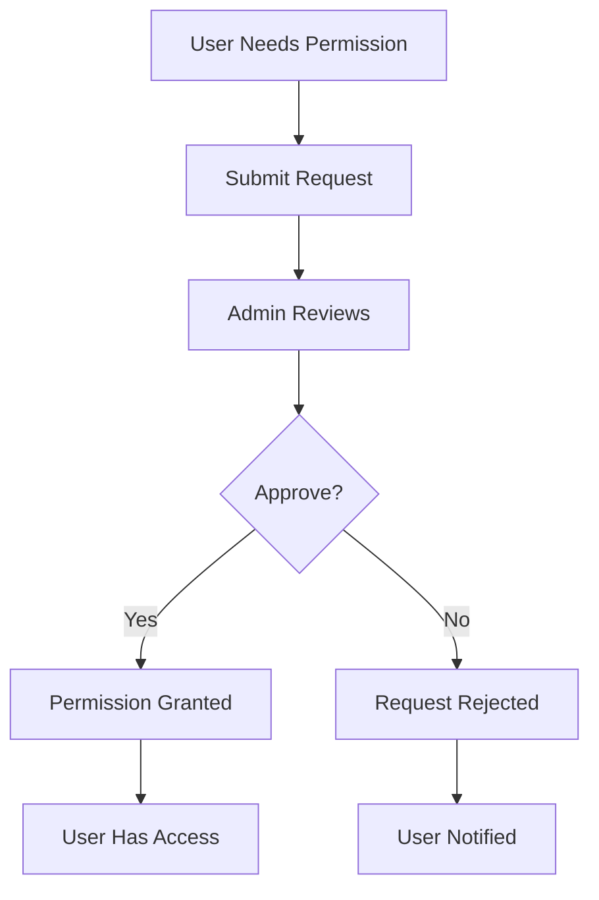

## Overview

The Platform API implements a flexible Role-Based Access Control (RBAC) system with:

- **Global Permissions** - Platform-level permissions assigned directly to users
- **Company Permissions** - Tenant-scoped permissions assigned via roles
- **Custom Roles** - Company-specific roles with configurable permissions
- **Permission Requests** - User-initiated requests for elevated access

---

## Permission Architecture

### Permission Scopes

Permissions have two scope types:

<ParamField path="scope" type="enum">
  - `GLOBAL` - Platform-level permissions (e.g., create companies, manage all users)
  - `COMPANY` - Company-scoped permissions (e.g., manage members, view reports)
</ParamField>

### Permission Key Format

Permissions use a structured key format:

```
RESOURCE:ACTION
```

<CodeGroup>
```javascript Examples
COMPANY:CREATE      // Create companies
COMPANY:DELETE      // Delete companies
MEMBER:INVITE       // Invite members
MEMBER:REMOVE       // Remove members
ROLE:CREATE         // Create roles
ROLE:ASSIGN         // Assign roles to members
PROJECT:CREATE      // Create projects
PROJECT:DELETE      // Delete projects
TIME_ENTRY:APPROVE  // Approve time entries
REPORT:VIEW         // View reports
```

```typescript Type Definition
type PermissionKey = `${string}:${string}`;

interface Permission {
  id: string;
  key: PermissionKey;
  description?: string;
  scope: 'GLOBAL' | 'COMPANY';
}
```
</CodeGroup>

---

## Creating Permissions

### Create Global Permission

Platform admins can create new permissions:

```bash Request
POST /api/permissions
Authorization: Bearer {admin-token}
Content-Type: application/json

{
  "key": "REPORT:EXPORT",
  "description": "Export reports to various formats",
  "scope": "COMPANY"
}
```

```json Response
{
  "success": true,
  "data": {
    "id": "perm-123",
    "key": "REPORT:EXPORT",
    "description": "Export reports to various formats",
    "scope": "COMPANY",
    "_count": {
      "roles": 0,
      "userGlobalPermissions": 0
    }
  }
}
```

<Warning>
Permission keys must be unique and follow the `RESOURCE:ACTION` format with uppercase letters and underscores only.
</Warning>

### List All Permissions

```bash Request
GET /api/permissions?page=1&limit=50&scope=COMPANY
Authorization: Bearer {token}
```

```json Response
{
  "success": true,
  "data": [
    {
      "id": "perm-001",
      "key": "COMPANY:CREATE",
      "description": "Create new companies",
      "scope": "GLOBAL",
      "_count": {
        "roles": 0,
        "userGlobalPermissions": 5
      }
    },
    {
      "id": "perm-002",
      "key": "MEMBER:INVITE",
      "description": "Invite members to company",
      "scope": "COMPANY",
      "_count": {
        "roles": 3,
        "userGlobalPermissions": 0
      }
    }
  ],
  "pagination": {
    "page": 1,
    "limit": 50,
    "total": 2,
    "totalPages": 1
  }
}
```

### Get All Permissions (No Pagination)

Useful for dropdown menus and selection interfaces:

```bash Request
GET /api/permissions/all
Authorization: Bearer {token}
```

```json Response
{
  "success": true,
  "data": [
    {
      "id": "perm-001",
      "key": "COMPANY:CREATE",
      "description": "Create new companies",
      "scope": "GLOBAL"
    },
    {
      "id": "perm-002",
      "key": "MEMBER:INVITE",
      "description": "Invite members to company",
      "scope": "COMPANY"
    }
  ]
}
```

---

## Managing Roles

### List Company Roles

```bash Request
GET /api/companies/{companyId}/roles
Authorization: Bearer {token}
```

```json Response
{
  "success": true,
  "data": [
    {
      "id": "role-owner",
      "companyId": "company-789",
      "name": "Owner",
      "description": "Company owner with full access",
      "color": "#EF4444",
      "isSystem": true,
      "isDefault": false,
      "createdAt": "2026-03-01T10:00:00Z",
      "updatedAt": "2026-03-01T10:00:00Z"
    },
    {
      "id": "role-member",
      "companyId": "company-789",
      "name": "Member",
      "description": "Standard member",
      "color": "#6B7280",
      "isSystem": true,
      "isDefault": true,
      "createdAt": "2026-03-01T10:00:00Z",
      "updatedAt": "2026-03-01T10:00:00Z"
    }
  ]
}
```

### Create Custom Role

Create a new role for your company:

```bash Request
POST /api/companies/{companyId}/roles
Authorization: Bearer {token}
Content-Type: application/json

{
  "name": "Project Manager",
  "description": "Manages projects and team resources",
  "color": "#8B5CF6"
}
```

```json Response
{
  "success": true,
  "data": {
    "id": "role-pm",
    "companyId": "company-789",
    "name": "Project Manager",
    "description": "Manages projects and team resources",
    "color": "#8B5CF6",
    "isSystem": false,
    "isDefault": false,
    "createdAt": "2026-03-04T20:00:00Z",
    "updatedAt": "2026-03-04T20:00:00Z"
  }
}
```

<Info>
Role names must be unique within a company. Colors should be hex format (#RRGGBB).
</Info>

### Update Role

```bash Request
PATCH /api/companies/{companyId}/roles/{roleId}
Authorization: Bearer {token}
Content-Type: application/json

{
  "name": "Senior Project Manager",
  "description": "Senior PM with additional oversight",
  "color": "#7C3AED"
}
```

```json Response
{
  "success": true,
  "data": {
    "id": "role-pm",
    "name": "Senior Project Manager",
    "description": "Senior PM with additional oversight",
    "color": "#7C3AED",
    "updatedAt": "2026-03-04T21:00:00Z"
  }
}
```

### Delete Role

```bash Request
DELETE /api/companies/{companyId}/roles/{roleId}
Authorization: Bearer {token}
```

```http Response
HTTP/1.1 204 No Content
```

<Warning>
**Cannot delete if:**
- Role is a system role (`isSystem: true`)
- Role is assigned to any members
- Role is set as the default role
</Warning>

### Role Properties

<ParamField path="isSystem" type="boolean" default="false">
  System roles (Owner, Admin, Member) are protected from deletion
</ParamField>

<ParamField path="isDefault" type="boolean" default="false">
  Default role is automatically assigned to new members. Only one per company.
</ParamField>

<ParamField path="color" type="string" default="#6366F1">
  Hex color code for UI display (e.g., `#EF4444`)
</ParamField>

---

## Assigning Permissions to Roles

### Add Permissions to Role

Permissions are assigned to roles through the role-permission relationship:

```javascript Service Example
// In your application service layer
await prisma.rolePermission.createMany({
  data: [
    {
      roleId: "role-pm",
      permissionId: "perm-project-create"
    },
    {
      roleId: "role-pm",
      permissionId: "perm-project-update"
    },
    {
      roleId: "role-pm",
      permissionId: "perm-member-invite"
    }
  ],
  skipDuplicates: true
});
```

### Get Role with Permissions

```javascript Query Example
const roleWithPermissions = await prisma.role.findUnique({
  where: { id: "role-pm" },
  include: {
    permissions: {
      include: {
        permission: true
      }
    }
  }
});

// Result structure
{
  id: "role-pm",
  name: "Project Manager",
  permissions: [
    {
      permission: {
        id: "perm-001",
        key: "PROJECT:CREATE",
        description: "Create new projects"
      }
    },
    {
      permission: {
        id: "perm-002",
        key: "PROJECT:UPDATE",
        description: "Update existing projects"
      }
    }
  ]
}
```

### Remove Permission from Role

```javascript Service Example
await prisma.rolePermission.delete({
  where: {
    roleId_permissionId: {
      roleId: "role-pm",
      permissionId: "perm-member-invite"
    }
  }
});
```

<Note>
Removing a permission from a role immediately affects all members with that role.
</Note>

---

## Global Permissions

### Grant Global Permission to User

Platform admins can grant global permissions directly to users:

```javascript Service Example
await prisma.userGlobalPermission.create({
  data: {
    userId: "user-123",
    permissionId: "perm-company-create",
    grantedBy: "admin-user-id"
  }
});
```

### Check Global Permissions

```javascript Middleware Example
export function checkGlobalPermission(permissionKey: string) {
  return async (req: Request, res: Response, next: NextFunction) => {
    const userId = req.user?.userId;
    
    // Check if user is platform admin (bypass)
    if (req.isPlatformAdmin) {
      return next();
    }
    
    // Check if user has the global permission
    const hasPermission = await prisma.userGlobalPermission.findFirst({
      where: {
        userId,
        permission: {
          key: permissionKey
        }
      }
    });
    
    if (!hasPermission) {
      return res.status(403).json({
        success: false,
        error: 'Insufficient permissions'
      });
    }
    
    next();
  };
}
```

### List User's Global Permissions

```javascript Query Example
const userPermissions = await prisma.userGlobalPermission.findMany({
  where: { userId: "user-123" },
  include: {
    permission: true
  }
});

// Result
[
  {
    userId: "user-123",
    permissionId: "perm-001",
    grantedAt: "2026-03-01T10:00:00Z",
    grantedBy: "admin-user-id",
    permission: {
      id: "perm-001",
      key: "COMPANY:CREATE",
      description: "Create new companies",
      scope: "GLOBAL"
    }
  }
]
```

---

## Permission Requests

### Get Available Permissions

Users can view permissions they can request:

```bash Request
GET /api/permission-requests/available-permissions
Authorization: Bearer {token}
```

```json Response
{
  "success": true,
  "data": [
    {
      "id": "perm-001",
      "key": "COMPANY:CREATE",
      "description": "Create new companies",
      "scope": "GLOBAL"
    },
    {
      "id": "perm-002",
      "key": "REPORT:EXPORT",
      "description": "Export reports",
      "scope": "COMPANY"
    }
  ]
}
```

### Create Permission Request

Users can request global permissions:

```bash Request
POST /api/permission-requests
Authorization: Bearer {token}
Content-Type: application/json

{
  "type": "GLOBAL_PERMISSION",
  "requestedPermissionId": "perm-001",
  "reason": "Need to create companies for client projects"
}
```

```json Response
{
  "success": true,
  "data": {
    "id": "req-123",
    "userId": "user-123",
    "type": "GLOBAL_PERMISSION",
    "status": "PENDING",
    "requestedPermissionId": "perm-001",
    "reason": "Need to create companies for client projects",
    "createdAt": "2026-03-04T18:41:00Z"
  },
  "message": "Permission request submitted successfully. An admin will review it soon."
}
```

### List User's Permission Requests

```bash Request
GET /api/permission-requests?status=PENDING
Authorization: Bearer {token}
```

```json Response
{
  "success": true,
  "data": [
    {
      "id": "req-123",
      "type": "GLOBAL_PERMISSION",
      "status": "PENDING",
      "requestedPermission": {
        "id": "perm-001",
        "key": "COMPANY:CREATE",
        "description": "Create new companies"
      },
      "reason": "Need to create companies for client projects",
      "createdAt": "2026-03-04T18:41:00Z"
    }
  ],
  "pagination": {
    "page": 1,
    "limit": 20,
    "total": 1,
    "totalPages": 1
  }
}
```

### Admin Reviews Permission Request

Platform admins can approve or reject requests:

```bash Request
POST /api/permission-requests/admin/{requestId}/review
Authorization: Bearer {admin-token}
Content-Type: application/json

{
  "action": "approve",
  "reviewNotes": "Approved for Q1 client projects"
}
```

```json Response
{
  "success": true,
  "data": {
    "id": "req-123",
    "status": "APPROVED",
    "reviewedBy": "admin-user-id",
    "reviewedAt": "2026-03-04T19:00:00Z",
    "reviewNotes": "Approved for Q1 client projects"
  },
  "message": "Permission request approved and permission granted to user."
}
```

<Check>
When a permission request is approved, the system automatically:
- Updates request status to `APPROVED`
- Creates a `UserGlobalPermission` record
- Grants the user immediate access
</Check>

### Cancel Permission Request

```bash Request
POST /api/permission-requests/{requestId}/cancel
Authorization: Bearer {token}
```

```json Response
{
  "success": true,
  "data": {
    "id": "req-123",
    "status": "CANCELLED"
  },
  "message": "Permission request cancelled"
}
```

### Request Status Values

<ParamField path="status" type="enum">
  - `PENDING` - Awaiting admin review
  - `APPROVED` - Request approved, permission granted
  - `REJECTED` - Request denied by admin
  - `CANCELLED` - Request cancelled by user
</ParamField>

---

## Permission Checking

### Check User's Company Permissions

```javascript Helper Function
async function hasCompanyPermission(
  userId: string,
  companyId: string,
  permissionKey: string
): Promise<boolean> {
  const membership = await prisma.membership.findUnique({
    where: {
      companyId_userId: { companyId, userId }
    },
    include: {
      roles: {
        include: {
          role: {
            include: {
              permissions: {
                include: {
                  permission: true
                }
              }
            }
          }
        }
      }
    }
  });

  if (!membership) return false;

  // Check if any of the user's roles have the permission
  for (const membershipRole of membership.roles) {
    const hasPermission = membershipRole.role.permissions.some(
      rp => rp.permission.key === permissionKey
    );
    if (hasPermission) return true;
  }

  return false;
}
```

### Usage in Middleware

```javascript Express Middleware
export function requireCompanyPermission(permissionKey: string) {
  return async (req: Request, res: Response, next: NextFunction) => {
    const userId = req.user?.userId;
    const companyId = req.params.companyId || req.body.companyId;
    
    // Platform admins bypass all checks
    if (req.isPlatformAdmin) {
      return next();
    }
    
    const hasPermission = await hasCompanyPermission(
      userId,
      companyId,
      permissionKey
    );
    
    if (!hasPermission) {
      return res.status(403).json({
        success: false,
        error: 'Insufficient permissions'
      });
    }
    
    next();
  };
}

// Usage
router.post(
  '/companies/:companyId/projects',
  requireCompanyPermission('PROJECT:CREATE'),
  projectController.create
);
```

---

## Best Practices

### Permission Naming Convention

<Check>
**Follow this structure:**
- Use UPPERCASE letters
- Separate resource and action with colon `:`
- Use underscores for multi-word resources
- Keep actions consistent: `CREATE`, `READ`, `UPDATE`, `DELETE`, `INVITE`, `REMOVE`, etc.
</Check>

```javascript Examples
// Good
TIME_ENTRY:CREATE
TIME_ENTRY:APPROVE
CLIENT_RATE:UPDATE
REPORT:EXPORT

// Bad
CreateTimeEntry      // Not uppercase
timeentry:create    // Not uppercase
TIME-ENTRY:CREATE   // Use underscore, not hyphen
```

### Role Design Strategy

<Steps>
  <Step title="Start with Defaults">
    Use the automatically created Owner, Admin, Manager, and Member roles
  </Step>
  <Step title="Create Specialized Roles">
    Add roles for specific job functions (Project Manager, HR Manager, Accountant)
  </Step>
  <Step title="Assign Permissions">
    Grant only the permissions needed for each role's responsibilities
  </Step>
  <Step title="Test Access">
    Verify users can perform required actions and cannot access restricted features
  </Step>
</Steps>

### Global vs Company Permissions

<CardGroup cols={2}>
  <Card title="Global Permissions" icon="globe" color="#3B82F6">
    Platform administration:
    - `COMPANY:CREATE`
    - `USER:MANAGE_ALL`
    - `PERMISSION:CREATE`
    - `ADMIN:ACCESS`
  </Card>
  <Card title="Company Permissions" icon="building" color="#8B5CF6">
    Company operations:
    - `MEMBER:INVITE`
    - `PROJECT:CREATE`
    - `TIME_ENTRY:APPROVE`
    - `REPORT:VIEW`
  </Card>
</CardGroup>

### Permission Request Workflow



### Audit Trail

Track permission changes:

```javascript Example
const auditLog = {
  action: 'PERMISSION_GRANTED',
  userId: 'user-123',
  permissionId: 'perm-001',
  grantedBy: 'admin-user-id',
  grantedAt: new Date(),
  reason: 'Approved via permission request'
};
```

---

## Related Resources

<CardGroup cols={2}>
  <Card title="Company Setup" icon="building" href="/guides/company-setup">
    Create and configure companies
  </Card>
  <Card title="User Management" icon="users" href="/guides/user-management">
    Manage members and roles
  </Card>
  <Card title="Time Tracking" icon="clock" href="/guides/time-tracking">
    Control access to time tracking
  </Card>
  <Card title="API Reference" icon="code" href="/api/permissions/overview">
    View complete API documentation
  </Card>
</CardGroup>
